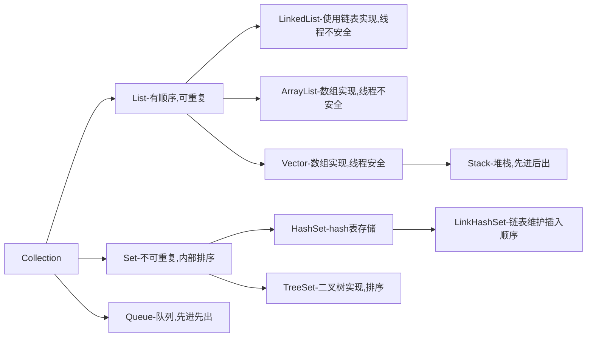

# （一） java集合分类

之前大概分为三种，`Set`，`List`，`Map`三种，JDK5之后，增加`Queue`.主要由`Collection`和`Map`两个接口衍生出来,同时`Collection`接口继承`Iterable`接口，所以我们也可以说java里面的集合类主要是由`Iterable`和`Map`两个接口以及他们的子接口或者其实现类组成。我们可以认为`Collection`接口定义了**单列集合**的规范，每次只能存储一个元素，而`Map`接口定义了**双列集合**的规范，每次能存储一对元素。


- `Iterable`接口:主要是实现遍历功能
    - `Collection`接口: 允许重复
        - `Set`接口：无序，元素不可重复,访问元素只能通过元素本身来访问。 
        - `List`接口：有序且可重复，可以根据元素的索引来访问集合中的元素。
        - `Queue`接口：队列,一般先进先出，可重复
 - `Map`接口：映射关系，简单理解为键值对<Key，Value>，Key不可重复，与`Collection`接口关系不大，只是个别函数使用到。

整个接口框架关系如下（来自百度百科）：


## （1） Iterable接口

### 1. 内部定义的方法
java集合 最源头的接口，实现这个接口的作用主要是集合对象可以通过迭代器去遍历每一个元素。


源码如下：
```  java
// 返回一个内部元素为T类型的迭代器（JDK1.5只有这个接口）
Iterator<T> iterator();

// 遍历内部元素，action意思为动作，指可以对每个元素进行操作（JDK1.8添加）
default void forEach(Consumer<? super T> action) {}

// 创建并返回一个可分割迭代器（JDK1.8添加），分割的迭代器主要是提供可以并行遍历元素的迭代器，可以适应现在cpu多核的能力，加快速度。
default Spliterator<T> spliterator() {
    return Spliterators.spliteratorUnknownSize(iterator(), 0);
}
```
从上面可以看出，`foreach`迭代以及可分割迭代，都加了`default`关键字，这个是Java 8 新的关键字，以前接口的所有接口，具体子类都必须实现，而对于`deafult`关键字标识的方法，其子类可以不用实现，这也是接口规范发生变化的一点。  
下面我们分别展示三个接口的调用：  

#### 1.1  iterator方法
```Java
public static void iteratorHasNext(){
    List<String> list=new ArrayList<String>();
    list.add("Jam");
    list.add("Jane");
    list.add("Sam");
    // 返回迭代器
    Iterator<String> iterator=list.iterator();
    // hashNext可以判断是否还有元素
    while(iterator.hasNext()){
        //next()作用是返回当前指针指向的元素,之后将指针移向下个元素
        System.out.println(iterator.next());
    }
}
```
当然也可以使用`for-each loop`方式遍历
```Java
for (String item : list) {
    System.out.println(item);
}
```
但是实际上，这种写法在`class`文件中也是会转成迭代器形式，这只是一个语法糖。`class`文件如下：
```  java
public class IterableTest {
    public IterableTest() { }
    public static void main(String[] args) {
        iteratorHasNext();
    }
    public static void iteratorHasNext() {
        List<String> list = new ArrayList();
        list.add("Jam");
        list.add("Jane");
        list.add("Sam");
        Iterator<String> iterator = list.iterator();
        Iterator var2 = list.iterator();
        while(var2.hasNext()) {
            String item = (String)var2.next();
            System.out.println(item);
        }
    }
}
```
需要注意的一点是，迭代遍历的时候，如果删除或者添加元素，都会抛出修改异常，这是由于快速失败`【fast-fail】`机制,属于一种自我保护的机制。
```  java
    public static void iteratorHasNext(){
        List<String> list=new ArrayList<String>();
        list.add("Jam");
        list.add("Jane");
        list.add("Sam");
        for (String item : list) {
            if(item.equals("Jam")){
                list.remove(item);
            }
            System.out.println(item);
        }
    }
```
从下面的错误我们可以看出，第一个元素是有被打印出来的，也就是remove操作是成功的，只是遍历到第二个元素的时候，迭代器检查，发现被改变了，所以抛出了异常。
```  java
Jam
Exception in thread "main" java.util.ConcurrentModificationException
	at java.util.ArrayList$Itr.checkForComodification(ArrayList.java:909)
	at java.util.ArrayList$Itr.next(ArrayList.java:859)
	at IterableTest.iteratorHasNext(IterableTest.java:15)
	at IterableTest.main(IterableTest.java:7)
```
#### 1.2 forEach方法
其实就是把对每一个元素的操作当成了一个对象传递进来，对每一个元素进行处理。
```  java
    default void forEach(Consumer<? super T> action) {
        Objects.requireNonNull(action);
        for (T t : this) {
            action.accept(t);
        }
    }
```  java
当然像`ArrayList`自然也是有自己的实现的，那我们就可以使用这样的写法,简洁优雅。`forEach()`在java8中参数是`java.util.function.Consumer`,可以称为**消费行为**或者说**动作**类型。
```  java
list.forEach(x -> System.out.print(x));
```
同时，我们只要实现`Consumer`接口，就可以自定义动作，如果不自定义，默认迭代顺序是按照元素的顺序。

```  java
public class ConsumerTest {
    public static void main(String[] args) {
        List<String> list=new ArrayList<String>();
        list.add("Jam");
        list.add("Jane");
        list.add("Sam");
        MyConsumer myConsumer = new MyConsumer();
        Iterator<String> it = list.iterator();
        list.forEach(myConsumer);
    }
    static class MyConsumer implements Consumer<Object> {
        @Override
        public void accept(Object t) {
            System.out.println("自定义打印：" + t);
        }

    }

}
```
输出的结果：
```  java
自定义打印：Jam
自定义打印：Jane
自定义打印：Sam
```
#### 1.3 spliterator方法
这是一个为了并行遍历数据元素而设计的迭代方法，返回的是`Spliterator`，是专门并行遍历的迭代器。以发挥多核时代的处理器性能，java默认在集合框架中提供了一个默认的`Spliterator`实现，底层也就是`Stream.isParallel()`实现的，我们可以看一下源码：
```java
    // stream使用的就是spliterator
    default Stream<E> stream() {
        return StreamSupport.stream(spliterator(), false);
    }
    default Spliterator<E> spliterator() {
        return Spliterators.spliterator(this, 0);
    }
    public static <T> Stream<T> stream(Spliterator<T> spliterator, boolean parallel) {
        Objects.requireNonNull(spliterator);
        return new ReferencePipeline.Head<>(spliterator,
                                            StreamOpFlag.fromCharacteristics(spliterator),
                                            parallel);
    }
```
使用的方法如下：
```java
    public static void spliterator(){
        List<String> list = Arrays.asList("1", "2", "3","4","5","6","7","8","9","10");
        // 获取可迭代器
        Spliterator<String> spliterator = list.spliterator();
        // 一个一个遍历
        System.out.println("tryAdvance: ");
        spliterator.tryAdvance(item->System.out.print(item+" "));
        spliterator.tryAdvance(item->System.out.print(item+" "));
        System.out.println("\n-------------------------------------------");

        // 依次遍历剩下的
        System.out.println("forEachRemaining: ");
        spliterator.forEachRemaining(item->System.out.print(item+" "));
        System.out.println("\n------------------------------------------");

        // spliterator1:0~10
        Spliterator<String> spliterator1 = list.spliterator();
        // spliterator1:6~10 spliterator2:0~5
        Spliterator<String> spliterator2 = spliterator1.trySplit();
        // spliterator1:8~10 spliterator3:6~7
        Spliterator<String> spliterator3 = spliterator1.trySplit();
        System.out.println("spliterator1: ");
        spliterator1.forEachRemaining(item->System.out.print(item+" "));
        System.out.println("\n------------------------------------------");
        System.out.println("spliterator2: ");
        spliterator2.forEachRemaining(item->System.out.print(item+" "));
        System.out.println("\n------------------------------------------");
        System.out.println("spliterator3: ");
        spliterator3.forEachRemaining(item->System.out.print(item+" "));
    }
```

- `tryAdvance（）` 一个一个元素进行遍历
- `forEachRemaining()` 顺序地分块遍历
- `trySplit()`进行分区形成另外的 `Spliterator`，使用在并行操作中，分出来的是前面一半，就是不断把前面一部分分出来

结果如下：
```java
tryAdvance: 
1 2 
-------------------------------------------
forEachRemaining: 
3 4 5 6 7 8 9 10 
------------------------------------------
spliterator1: 
8 9 10 
------------------------------------------
spliterator2: 
1 2 3 4 5 
------------------------------------------
spliterator3: 
6 7 
```
还有一些其他的用法在这里就不列举了，主要是`trySplit()`之后，可以用于多线程遍历。理想的时候，可以平均分成两半，有利于并行计算，但是不是一定平分的。

### 2. Collection接口 extend Iterable<E>

`Collection`接口可以算是集合类的一个根接口之一，一般不能够直接使用，只是定义了一个规范，定义了添加，删除等管理数据的方法。继承`Collection`接口的有`List`，`Set`,`Queue`,不过`Queue`定义了自己的一些接口，相对来说和其他的差异比较大。
#### 2.1 内部定义的方法


源码如下：
```java
boolean add(Object o)    //添加元素

boolean remove(Object o)  //移除元素

boolean addAll(Collection c) //批量添加

boolean removeAll(Collection c)  //批量移除

void retainAll(Collection c)   // 移除在c中不存在的元素

void clear()  //清空集合

int size()   //集合大小

boolean isEmpty()    //是否为空

boolean contains(Object o)    //是否包含在集合中

boolean containsAll(Collection c)    //是否包含所有的元素

Iterator<E> iterator()    // 获取迭代器

Object[] toArray()	  // 转成数组

default boolean removeIf(Predicate<? super E> filter) {} // 删除集合中复合条件的元素，删除成功返回true

boolean equals(Object o)

int hashCode()

default Spliterator<E> spliterator() {} //获取可分割迭代器

default Stream<E> stream() {}   //获取流

default Stream<E> parallelStream() {} //获取并行流

```
里面获取并行流的方法`parallelStream()`,其实就是通过默认的`ForkJoinPool`（主要用来使用分治法(Divide-and-Conquer Algorithm)来解决问题），提高多线程任务的速度。我们可以使用ArrayList来演示一下平行处理能力。例如下面的例子，输出的顺序就不一定是1,2,3...，可能是乱序的，这是因为任务会被分成多个小任务，任务执行是没有特定的顺序的。

```java
List<Integer> list = Arrays.asList(1, 2, 3, 4, 5, 6, 7, 8, 9);
list.parallelStream()
       .forEach(out::println);
```


#### 2.2 继承Collection的主要接口

    
##### 2.2.1 List extend Collection<E>
继承于`Collection`接口，有顺序，取出的顺序与存入的顺序一致，有索引，可以根据索引获取数据，允许存储重复的元素，可以放入为null的元素。  
最常见的三个实现类就是`ArrayList`，`Vector`,`LinkedList`，`ArrayList`和`Vector`都是内部封装了对数组的操作，唯一不同的是，`Vector`是线程安全的，而`ArrayList`不是，理论上`ArrayList`操作的效率会比`Vector`好一些。

里面是接口定义的方法：
```  java
int size();  //获取大小

boolean isEmpty();  //判断是否为空

boolean contains(Object o);  //是否包含某个元素

Iterator<E> iterator(); //获取迭代器

Object[] toArray();  // 转化成为数组（对象）

<T> T[] toArray(T[] a);  // 转化为数组（特定位某个类）

boolean add(E e); //添加

boolean remove(Object o);  //移除元素

boolean containsAll(Collection<?> c); // 是否包含所有的元素

boolean addAll(Collection<? extends E> c); //批量添加

boolean addAll(int index, Collection<? extends E> c); //批量添加，指定开始的索引

boolean removeAll(Collection<?> c); //批量移除

boolean retainAll(Collection<?> c); //将c中不包含的元素移除

default void replaceAll(UnaryOperator<E> operator) {}//替换

default void sort(Comparator<? super E> c) {}// 排序

void clear();//清除所有的元素

boolean equals(Object o);//是否相等

int hashCode(); //计算获取hash值

E get(int index); //通过索引获取元素

E set(int index, E element);//修改元素

void add(int index, E element);//在指定位置插入元素

E remove(int index);//根据索引移除某个元素

int indexOf(Object o);  //根据对象获取索引

int lastIndexOf(Object o); //获取对象元素的最后一个元素

ListIterator<E> listIterator(); // 获取List迭代器

ListIterator<E> listIterator(int index); // 根据索引获取当前的位置的迭代器

List<E> subList(int fromIndex, int toIndex); //截取某一段数据

default Spliterator<E> spliterator(){} //获取可切分迭代器
```
上面的方法都比较简单，值得一提的是里面出现了`ListIterator`，这是一个功能更加强大的迭代器，继承于`Iterator`,只能用于`List`类型的访问，拓展功能例如：通过调用`listIterator()`方法获得一个指向List开头的`ListIterator`，也可以调用`listIterator(n)`获取一个指定索引为n的元素的`ListIterator`,这是一个可以双向移动的迭代器。  
操作数组索引的时候需要注意，由于List的实现类底层很多都是数组，所以索引越界会报错`IndexOutOfBoundsException`。  
说起List的实现子类：  
- `ArrayList`：底层存储结构是数组结构，增加删除比较慢，查找比较快，是最常用的List集合。线程不安全。
- `LinkedList`：底层是链表结构，增加删除比较快，但是查找比较慢。线程不安全。
- `Vector`：和ArrayList差不多，但是是线程安全的，即同步。

##### 2.2.2 Set extend Collection<E>
`Set`接口，不允许放入重复的元素，也就是如果相同，则只存储其中一个。  


下面是源码方法：
```java
int size(); //获取大小

boolean isEmpty();  //是否为空
 
boolean contains(Object o); //是否包含某个元素

Iterator<E> iterator(); //获取迭代器

Object[] toArray(); //转化成为数组

<T> T[] toArray(T[] a); //转化为特定类的数组

boolean add(E e);   //添加元素

boolean remove(Object o);   //移除元素

boolean containsAll(Collection<?> c);   //是否包含所有的元素

boolean addAll(Collection<? extends E> c);  //批量添加

boolean retainAll(Collection<?> c); //移除所有不存在于c集合中的元素

boolean removeAll(Collection<?> c); //移除所有在c集合中存在的元素

void clear();   //清空集合

boolean equals(Object o);   //是否相等

int hashCode(); //计算hashcode

default Spliterator<E> spliterator() {}     //获取可分割迭代器
        
```
主要的子类：

- `HashSet`
    - 允许空值
    - 通过`HashCode`方法计算获取`hash`值，确定存储位置，无序。
- `LinkedHashSet`
    - `HashSet`的子类
    - 有顺序
- `TreeSet`
    - 如果无参数构建`Set`，则需要实现`Comparable`方法。
    - 亦可以创建时传入比较方法，用于排序。 

##### 2.2.3 Queue extend Collection<E>
队列接口，在`Collection`接口的接触上添加了增删改查接口定义，一般默认是先进先出，即`FIFO`，除了优先队列和栈，优先队列是自己定义了排序的优先顺序，队列中不允许放入null元素。


下面是源码：
```java
boolean add(E e);   //插入一个元素到队列，失败时返回IllegalStateException （如果队列容量不够）

boolean offer(E e); //插入一个元素到队列，失败时返回false

E remove(); //移除队列头的元素并移除

E poll();   //返回并移除队列的头部元素，队列为空时返回null

E element();    //返回队列头元素

E peek();   //返回队列头部的元素，队列为空时返回null
```
主要的子接口以及实现类有：


- Deque（接口）:Queue的子接口，双向队列，可以从两边存取
    - ArrayDeque：Deque的实现类，底层用数组实现，数据存贮在数组中
- AbstractQueue：Queue的子接口，仅实现了add、remove和element三个方法
    -  PriorityQueue：按照默认或者自己定义的顺序来排序元素，底层使用堆（完全二叉树）实现，使用动态数组实现，
- BlockingQueue： 在java.util.concurrent包中，阻塞队列，满足当前无法处理的操作。

## （2） Map接口
- 定义双列集合的规范`Map<K，V>`，每次存储一对元素，即`key`和`value`。
- `key`的类型可以和`value`的类型相同，也可以不同，任意的引用类型都可以。
- `key`是不允许重复的，但是`value`是可以重复的，所谓重复是指计算的`hash`值。


下面的源码的方法：
```java
V put(K key, V value);  // 添加元素

V remove(Object key);   // 删除元素

void putAll(Map<? extends K, ? extends V> m); // 批量添加

void clear()  // 移除所有元素

V get(Object key);  // 通过key查询元素

int size();    // 查询集合大小

boolean isEmpty();    // 集合是否为空

boolean containsKey(Object key);     // 是否包含某个key
    
boolean containsValue(Object value);     // 是否包含某个value

Set<K> keySet(); // 获取所有key的set集合

Collection<V> values(); // 获取所有的value的set集合

Set<Map.Entry<K, V>> entrySet();    // 返回键值对的set，每一个键值对是一个entry对象

boolean equals(Object o);   // 用于比较的函数

int hashCode(); // 计算hashcode

default V getOrDefault(Object key, V defaultValue) // 获取key对应的Value，没有则返回默认值（）
            
default void forEach(BiConsumer<? super K, ? super V> action) {}  // 遍历

default void replaceAll(BiFunction<? super K, ? super V, ? extends V> function) {}  // 批量替换

// 缺少这个key的时候才会添加进去
// 返回值是是key对应的value值，如果不存在，则返回的是刚刚放进去的value
default V putIfAbsent(K key, V value) {} 

default boolean remove(Object key, Object value) {}  // 移除元素

default boolean replace(K key, V oldValue, V newValue) {}   // 替换

default V replace(K key, V value) {}  //替换

// 和putIfAbsent有点像，只不过传进去的mappingFunction是映射函数，也就是如果不存在key对应的value，将会执行函数，函数返回值会被当成value添加进去，同时返回新的value值
default V computeIfAbsent(K key,Function<? super K, ? extends V> mappingFunction) {} 
// 和computeIfAbsent方法相反，只有key存在的时候，才会执行函数，并且返回
default V computeIfPresent(K key,BiFunction<? super K, ? super V, ? extends V> remappingFunction) {}

// 不管如何都会执行映射函数，返回value            
default V compute(K key,BiFunction<? super K, ? super V, ? extends V> remappingFunction) {}
    
default V merge(K key, V value,BiFunction<? super V, ? super V, ? extends V> remappingFunction) {}
```
值得注意的是，Map里面定义了一个Entry类，其实就是定义了一个存储数据的类型，一个entry就是一个`<key,value>`.  
Map的常用的实现子类：
- `HashMap`：由数组和链表组成，线程不安全，无序。
- `LinkedHashMap`：如果我们需要是有序的，那么就需要它，时间和空间效率没有`HashMap`那么高，底层是维护一条双向链表，保证了插入的顺序。
- `ConcurrentHashMap`：线程安全，1.7JDK使用锁分离，每一段Segment都有自己的独立锁，相对来说效率也比较高。JDK1.8抛弃了Segment，使用Node数组+链表和红黑树实现，在线程安全控制上使用`Synchronize`和`CAS`，可以认为是**优化的线程安全的**`HashMap`。
- `HashTable`：对比与`HashMap`主要是使用关键字`synchronize`，加上同步锁，线程安全。

# （二）总结

这些集合原始接口到底是什么？为什么需要？

我想，这些接口其实都是一种规则/规范的定义，如果不这么做也可以，所有的子类自己实现，但是从迭代以及维护的角度来说，这就是一种抽象或者分类，比如定义了`Iterator`接口，某一些类就可以去继承或者实现，那就得遵守这个规范/契约。可以有所拓展，每个子类的拓展不一样，所以每个类就各有所长，但是都有一个中心，就是原始的集合接口。比如实现`Map`接口的所有类的中心思想都不变，都是`<key,value>`只是各有所长，各分千秋，形成了大千集合世界。

**【作者简介】**：
秦怀，公众号【**秦怀杂货店**】作者，技术之路不在一时，山高水长，纵使缓慢，驰而不息。这个世界希望一切都很快，更快，但是我希望自己能走好每一步，写好每一篇文章，期待和你们一起交流。

此文章仅代表自己（本菜鸟）学习积累记录，或者学习笔记，如有侵权，请联系作者核实删除。人无完人，文章也一样，文笔稚嫩，在下不才，勿喷，如果有错误之处，还望指出，感激不尽~ 


