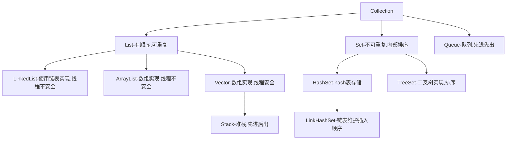

[TOC]
# 一、Collection接口简介
`collection`在java集合中，算是顶级接口，它继承了`iterable`接口，不能实例化，只能实例化其子类。之所以需要这样一个接口，是因为java作为面向对象，总是避免不了处理多个对象的情况，要处理多个对象，首先需要容器存储，这个容器就是集合。为什么有了数组，还需要集合，因为数组的功能单一，长度不可变，而有些集合实现类则是对数组操作的封装。

`Collection`集合和数组的区别：
- 集合长度可以变，数组是定长的
- 集合存储的元素只能是引用类型，而数组则可以是基本类型
- 数组只能执行基本操作，而集合功能经过拓展，更加丰富。


    
# 二、Collection源码分析
`Collection`继承于`Iterable`接口，而`Iterable`接口，是集合的顶级接口，没有之一，`Iterable`接口定义的功能是可以迭代，也就是获取迭代器`iterator`的功能，因此`Collection`以及其实现类也间接获得迭代的功能。  

为什么需要这样子定义呢？我陷入了深深地思考...🤔

其实，这也算是哲学问题，java的类的设计是经过很长时间的考验以及调整形成的，平衡修改以及耦合等各方面的原因，结构更加清晰，维护成本更低，逻辑性更强。这些接口就是一个个标准或者规范，其子类就是不断拓展功能，这些接口的形成是一种抽象，将能迭代事物抽象成为迭代器`iterator`,将获取迭代器，也就是迭代能力抽象成`iterable`。
`Collection`则是获得迭代能力的接口之一，其实`Map`的实现类里面也是有使用到`iterable`接口，几乎所有的集合实现类都是需要遍历元素的，所以这个`iterable`也是必须存在的，存在即合理。  

下面看`Collection`接口以及`iterable`接口的方法对比：

从上面的图我们可以看出，`iterable`接口功能主要是
- 获取迭代器`iterator`
- foreach()遍历
- 获取可切分迭代器`Spliterator`

`Collection`接口在此基础上进行拓展，源码接口如下：
```java
boolean add(Object o)    //添加元素

boolean remove(Object o)  //移除元素

boolean addAll(Collection c) //批量添加

boolean removeAll(Collection c)  //批量移除

void retainAll(Collection c)   // 移除在c中不存在的元素

void clear()  //清空集合

int size()   //集合大小

boolean isEmpty()    //是否为空

boolean contains(Object o)    //是否包含在集合中

boolean containsAll(Collection c)    //是否包含所有的元素

Iterator<E> iterator()    // 获取迭代器

Object[] toArray()	  // 转成数组

default boolean removeIf(Predicate<? super E> filter) {} // 删除集合中复合条件的元素，删除成功返回true

boolean equals(Object o)

int hashCode()

default Spliterator<E> spliterator() {} //获取可分割迭代器

default Stream<E> stream() {}   //获取流

default Stream<E> parallelStream() {} //获取并行流

```
里面获取并行流的方法`parallelStream()`,其实就是通过默认的ForkJoinPool（主要用来使用分治法(Divide-and-Conquer Algorithm)来解决问题），提高多线程任务的速度。我们可以使用ArrayList来演示一下平行处理能力。例如下面的例子，输出的顺序就不一定是1,2,3...，可能是乱序的，这是因为任务会被分成多个小任务，任务执行是没有特定的顺序的。

```java
List<Integer> list = Arrays.asList(1, 2, 3, 4, 5, 6, 7, 8, 9);
list.parallelStream()
       .forEach(out::println);
```
上面源代码可以看出，`Collection`接口定义了功能规范，有以下功能方法：
- 添加元素
- 删除元素
- 判断是否包含/是否全部包含/是否为空
- 获取迭代器/可分割迭代器
- 获取长度
- 取交集
- 获取流/并行流

我们遍历元素的时候可以获取`Iterator`,但是具体的实现是以子类的特性去实现的，比如`ArrayList`是用内部类的方式实现了`Iterator`接口。
# 三、Collection的子类以及子类的实现
继承`Collection`的子类关系如下：


上面的类图已经足够清楚，下面是一些简单的概括（上面的类型是使用IDEA的类图功能自动生成，简直不能太好用🤣🤣🤣感觉发现了新大陆）


## 3.1 List extend Collection<E>
继承于`Collection`接口，有顺序，取出的顺序与存入的顺序一致，有索引，可以根据索引获取数据，允许存储重复的元素，可以放入为null的元素。  
最常见的三个实现类就是`ArrayList`，`Vector`,`LinkedList`，`ArrayList`和`Vector`都是内部封装了对数组的操作，唯一不同的是，`Vector`是线程安全的，而`ArrayList`不是，理论上`ArrayList`操作的效率会比`Vector`好一些。

里面是接口定义的方法：
```java
int size();  //获取大小

boolean isEmpty();  //判断是否为空

boolean contains(Object o);  //是否包含某个元素

Iterator<E> iterator(); //获取迭代器

Object[] toArray();  // 转化成为数组（对象）

<T> T[] toArray(T[] a);  // 转化为数组（特定位某个类）

boolean add(E e); //添加

boolean remove(Object o);  //移除元素

boolean containsAll(Collection<?> c); // 是否包含所有的元素

boolean addAll(Collection<? extends E> c); //批量添加

boolean addAll(int index, Collection<? extends E> c); //批量添加，指定开始的索引

boolean removeAll(Collection<?> c); //批量移除

boolean retainAll(Collection<?> c); //将c中不包含的元素移除

default void replaceAll(UnaryOperator<E> operator) {}//替换

default void sort(Comparator<? super E> c) {}// 排序

void clear();//清除所有的元素

boolean equals(Object o);//是否相等

int hashCode(); //计算获取hash值

E get(int index); //通过索引获取元素

E set(int index, E element);//修改元素

void add(int index, E element);//在指定位置插入元素

E remove(int index);//根据索引移除某个元素

int indexOf(Object o);  //根据对象获取索引

int lastIndexOf(Object o); //获取对象元素的最后一个元素

ListIterator<E> listIterator(); // 获取List迭代器

ListIterator<E> listIterator(int index); // 根据索引获取当前的位置的迭代器

List<E> subList(int fromIndex, int toIndex); //截取某一段数据

default Spliterator<E> spliterator(){} //获取可切分迭代器
```
上面的方法都比较简单，值得一提的是里面出现了`ListIterator`，这是一个功能更加强大的迭代器，继承于`Iterator`,只能用于`List`类型的访问，拓展功能例如：通过调用`listIterator()`方法获得一个指向List开头的`ListIterator`，也可以调用`listIterator(n)`获取一个指定索引为n的元素的`ListIterator`,这是一个可以双向移动的迭代器。  
操作数组索引的时候需要注意，由于List的实现类底层很多都是数组，所以索引越界会报错`IndexOutOfBoundsException`。  
说起List的实现子类：  
- ArrayList：底层存储结构是数组结构，增加删除比较慢，查找比较快，是最常用的List集合。线程不安全。
- LinkedList：底层是链表结构，增加删除比较快，但是查找比较慢。线程不安全。
- Vector：和ArrayList差不多，但是是线程安全的，即同步。

## 3.2 Set extend Collection<E>
`Set`接口，不允许放入重复的元素，也就是如果相同，则只存储其中一个。  


下面是源码方法：
```java
int size(); //获取大小

boolean isEmpty();  //是否为空
 
boolean contains(Object o); //是否包含某个元素

Iterator<E> iterator(); //获取迭代器

Object[] toArray(); //转化成为数组

<T> T[] toArray(T[] a); //转化为特定类的数组

boolean add(E e);   //添加元素

boolean remove(Object o);   //移除元素

boolean containsAll(Collection<?> c);   //是否包含所有的元素

boolean addAll(Collection<? extends E> c);  //批量添加

boolean retainAll(Collection<?> c); //移除所有不存在于c集合中的元素

boolean removeAll(Collection<?> c); //移除所有在c集合中存在的元素

void clear();   //清空集合

boolean equals(Object o);   //是否相等

int hashCode(); //计算hashcode

default Spliterator<E> spliterator() {}     //获取可分割迭代器
        
```
主要的子类：

- HashSet
    - 允许空值
    - 通过HashCode方法计算获取hash值，确定存储位置，无序。
    - 底层是哈希表，一个元素为链表的数组
- LinkedHashSet
    - HashSet的子类
    - 有顺序
    - 底层由哈希表组成
- TreeSet
    - 如果无参数构建Set，则需要实现Comparable方法。
    - 亦可以创建时传入比较方法，用于排序。 

## 3.3 Queue extend Collection<E>
队列接口，在Collection接口的接触上添加了增删改查接口定义，一般默认是先进先出，即FIFO，除了优先队列和栈，优先队列是自己定义了排序的优先顺序，队列中不允许放入null元素。


下面是源码：
```java
boolean add(E e);   //插入一个元素到队列，失败时返回IllegalStateException （如果队列容量不够）

boolean offer(E e); //插入一个元素到队列，失败时返回false

E remove(); //移除队列头的元素并移除

E poll();   //返回并移除队列的头部元素，队列为空时返回null

E element();    //返回队列头元素

E peek();   //返回队列头部的元素，队列为空时返回null
```
主要的子接口以及实现类有：


- Deque（接口）:Queue的子接口，双向队列，可以从两边存取
    - ArrayDeque：Deque的实现类，底层用数组实现，数据存贮在数组中
- AbstractQueue：Queue的子接口，仅实现了add、remove和element三个方法
    -  PriorityQueue：按照默认或者自己定义的顺序来排序元素，底层使用堆（完全二叉树）实现，使用动态数组实现，
- BlockingQueue： 在java.util.concurrent包中，阻塞队列，满足当前无法处理的操作。

**对于Collection集合我们应该使用哪一个？**

每个实现都有自己的特点，重要的是知道当前数据以及业务的特点，选取最适合的集合类进行数据操作。

- 元素唯一（Set）
    - 需要排序
        - 唯一，有序 （自定义排序）：TreeSet（速度较慢）
        - FIFO，按照插入顺序，唯一：LinkedHashSet（速度较快）
    - 不需要排序：HashSet（速度最快）
- 元素唯一
    - 列表：List
        - 线程安全：Vector
        - 接受线程不安全
            - 查询比较多：ArrayList
            - 增加删除操作较多：LinkedList     
    - 排队
        - 普通排队 ：Queue的子类
        - 两端都可以排队：ArrayDeque
        - 按照自己定义的规则排序：PriorityQueue
        - 处理排队当前无法处理太多请求（相当于缓冲）：阻塞队列接口BlockingQueue


# 四、Collection和Map的辨析
- `Collection`接口是存储单列元素，而`Map`是键值对<Key,Value>，也就是存储了双列元素。
- `Collection`接口继承了`Iterable`接口，而`Map`则不是，`Map`是在各自的实现类中才用内部类的方式实现`Iterator`接口，例如`HashMap`，key或者value或者它们的组合entry都可以使用迭代器进行遍历。
- 两个的子类其实是有交集的，比如`HashSet`的底层实现其实就是定义了一个`HashMap`，`TreeSet`同样依赖于Map接口的子实现类`TreeMap`。

`Map`集合可以存储键值对，可以获取所有的键，或者值或者键值对，键不允许重复，但是值可以重复。
随便说说`Map`相关的子类：
 - HashTable:
    - 源于JDK1.1，底层使用数组和链表
    - 线程安全，不允许null作为key或者value
 - HashMap:
    - 源于JDK1.2，JDK1.7以及之前使用数组+链表实现，JDK1.8使用数组+链表/红黑树
    - 线程不安全
 - LinkedHashMap:
    - 保存了插入的顺序，可以按照顺序遍历
 - TreeMap:
    - 实现了SortMap接口，可以把保存的记录按照键排序
    - 底层是用红黑树实现
    
# 五、Collection和Collections的辨析
（1）.`Collection`是集合的顶级接口之一，衍生出了`Set`，`List`，`Queue`等一系列接口以及实现类。而`Collections`是一个辅助类，就是实现一些排序，搜索，线程安全等功能，它主要体现的功能是操作集合，而`Collection`则是集合本身。

（2）.`Collection`是接口，其本身不能实例化，但是可以实例化为其子类或者实现类，但是`Collections`是包装类，一般不会实例化，直接调用static方法。

`Collections`接口主要提供了以下操作，只展示了部分，详细需要后面文章说：

1. Sort（排序）：`public static <T extends Comparable<? super T>> void sort(List<T> list)`，元素需要实现`Comparable`接口，按照比较器进行排序。
2. binarySearch（二分搜索）:`public static <T>int binarySearch(List<? extends Comparable<? super T>> list, T key)`,
3. reverse(反转)：`public static void reverse(List<?> list) `反转顺序
4. Shuffling(混排)：`public static void shuffle(List<?> list)`,将list的元素随机打乱。
5.  交换（swap）：`public static void swap(List<?> list, int i, int j) `交换两个索引的元素
6.  拷贝（copy）:`public static <T> void copy(List<? super T> dest, List<? extends T> src)`，copy出一个内容一致的`list`。
7.  返回最小的元素（min）：所谓大小，根据指定的比较器决定，`static <T extends Object & Comparable<? super T>> T min(Collection<? extends T> coll)`
8.  返回最大的元素（max）：`static <T extends Object & Comparable<? super T>> T max(Collection<? extends T> coll)`
9.  旋转（Rotate）：将一个List旋转，假如有个序列列list是[1,2,3,4]，调用方法Collections.rotate(list, 1)后，得到list就变成[4,1,2,3]，`public static void rotate(List<?> list, int distance)`
10.  替换所有元素（replaceAll）：`public static <T> boolean replaceAll(List<T> list, T oldVal, T newVal)`
11.  获取元素出现最后的索引（lastIndexOfSubList）：`public static int lastIndexOfSubList(List<?> source, List<?> target)`


# 六、总结
`Collection`接口继承了`iterable`接口，是集合的顶级接口之一，衍生接口有`List`,`Set`,`Queue`等，主要定义了元素的基本操作，删除，添加等等方法，迭代一个`Collection`可以使用`Iterator`，但是`Collection`本身不能实例化。

**【作者简介】**：
秦怀，公众号【**秦怀杂货店**】作者，技术之路不在一时，山高水长，纵使缓慢，驰而不息。这个世界希望一切都很快，更快，但是我希望自己能走好每一步，写好每一篇文章，期待和你们一起交流。

此文章仅代表自己（本菜鸟）学习积累记录，或者学习笔记，如有侵权，请联系作者核实删除。人无完人，文章也一样，文笔稚嫩，在下不才，勿喷，如果有错误之处，还望指出，感激不尽~ 


