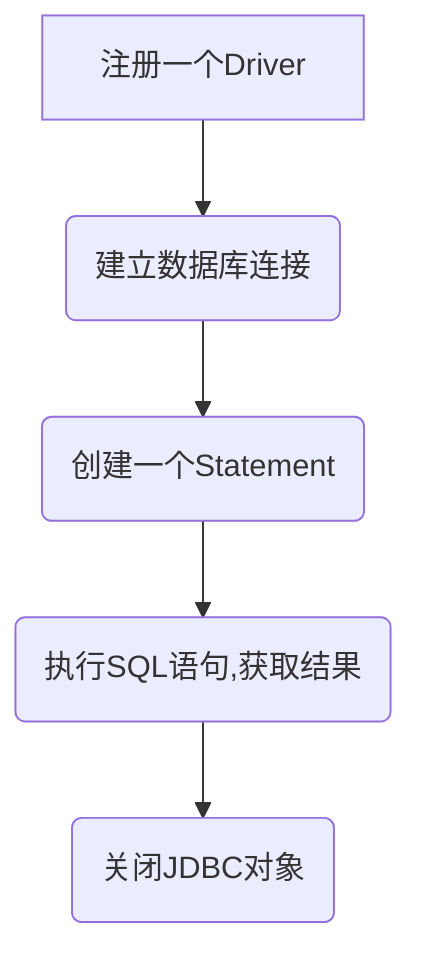

[TOC]
# 1. 工作原理
一般我们主要的`JDBC`处理流程如下：


## 1.1 加载驱动
首先声明：这个阶段在`JDK 1.6`之后就不需要手动执行了，也就是这个代码不需要了！！！分析它有利于理解流程。

```java
Class.forName("com.mysql.jdbc.Driver")
```
上面代码发生在注册`Driver`阶段，指的是让`JVM`将`com.mysql.jdbc.Driver`这个类加载入内存(运行时数据区)中，最重要的是**将`mysql`驱动注册到`DriverManager`中去**。

此处加载`Driver`的时候，加载的是`java.mysql.jdbc`包下的，这其实是一种向后兼容的做法，实际上代码都是写在了`com.mysql.cj.jdbc`下，所以，`mysql`的连接包使用了继承的方式，`com.mysql.jdbc.Driver`只是对外的一个兼容类，其父类是`com.mysql.cj.jdbc.Driver`，真正的`mysql Driver`驱动。

**加载`Driver`的目的就是加载它的父类**:

```java
public class Driver extends com.mysql.cj.jdbc.Driver {
    public Driver() throws SQLException {
        super();
    }
}
```
我们打开`com.mysql.cj.jdbc.Driver`,可以发现，里面有一个构造空方法，这也是调用`Class.forName().newInstance() `所需要的，这个类继承了`NonRegisteringDriver`，实现了`java.mysql.Driver`。
里面有一个空无参构造方法，为反射调用`newInstance()`准备的，另外就是静态代码块，静态代码块主要的功能是通过`DriverManager`注册自己（`Driver`，也就是驱动），这里很重要的一点，就是`Driver`是`java.sql.Driver`(这是jdk的包！！！)的实现。


> **我们引入的驱动本质上是`JDK`中的`Driver`的实现类，为啥？这就是标准，约束，不这样干，不合规矩。**

```java
public class Driver extends NonRegisteringDriver implements java.sql.Driver {
    static {
        try {
            // 调用DriverManager 注册自己（Driver）
            java.sql.DriverManager.registerDriver(new Driver());
        } catch (SQLException E) {
            throw new RuntimeException("Can't register driver!");
        }
    }
    public Driver() throws SQLException {
        // Class.forName().newInstance() 所需要的
    }
}
```

`DriverManager`里面基本全是`static`方法，也就是专门管理各种驱动的，`registerDriver()`方法如同其名字，就是为了注册驱动，注册到哪里呢？
看下面的代码，可以知道，`driverInfo`（驱动相关信息）会被添加到`registeredDrivers`里面去。`registeredDrivers`是`DriverManager`的`static`属性，里面存放着注册的驱动信息。如果这个驱动已经被注册，那么就不会再注册。

```java
    public static synchronized void registerDriver(java.sql.Driver driver)
        throws SQLException {
        registerDriver(driver, null);
    }
    public static synchronized void registerDriver(java.sql.Driver driver,
            DriverAction da)
        throws SQLException {

        /* Register the driver if it has not already been added to our list */
        if(driver != null) {
            // 将驱动相关信息加到registeredDrivers
            registeredDrivers.addIfAbsent(new DriverInfo(driver, da));
        } else {
            // This is for compatibility with the original DriverManager
            throw new NullPointerException();
        }

        println("registerDriver: " + driver);

    }
```
到这里其实`Class.forName(“com.mysql.jdbc.Driver”)`这句代码分析就结束了。

### 1.1.1 类加载相关知识
类加载，是将类的`.class`文件（二进制数据）翻译读进内存中，放在虚拟机的运行时数据区里面的方法区（元空间）内。对应的在堆里面创建一个`java.lang.Class`对象，`java`里面万物皆对象，类本质也是对象（Klass），这个创建的对象就是封装了类本身在方法区的数据结构，这才是类加载的目的。
再简单一点，就是将类的信息，弄成一个`Class`对象，放到堆上面，其数据结构在方法区，堆上面的对象是一种封装。

类加载有三种方式，后面两种是反射的时候使用居多。
- 程序启动的时候`JVM`自动初始化加载
- 调用`Class.forName()`手动加载
- 调用`ClassLoader.loadClass()`手动加载

为什么使用`Class.forName()`而不是`ClassLoader.loadClass()`,一定要这样做么？两者有什么区别？（先埋一个坑)先简单解释一下：

`Class.forName()`除了将类的`.Class`文件加载到`JVM`中之外，还会对类进行解释，执行类的`static`代码块，也就是默认会初始化类的一些数据（可以设置为不执行）。但是`classLoader`是没有的，`classLoader`只有在`newInstance()`的时候才会执行`static`块。
而我们上面看到的`com.mysql.cj.jdbc.Driver`这个类就是使用static的方式将自己注册到`DriverManager`中，所以需要使用`Class.forName()`。

`Class.forName(xxx.xx.xx).newInstance()`可不可以，可以，但是没有必要。这样相当于顺带创建出了实例。我们只是需要满足`在JDBC规范中明确要求这个Driver类必须向DriverManager注冊自己`这个条件，而触发其中的静态代码块即可。

> we just want to load the driver to jvm only, but not need to user the instance of driver,
so call Class.forName(xxx.xx.xx) is enough, if you call Class.forName(xxx.xx.xx).newInstance(),
the result will same as calling Class.forName(xxx.xx.xx),
because Class.forName(xxx.xx.xx).newInstance() will load driver first,
and then create instance, but the instacne you will never use in usual,
so you need not to create it.

### 1.1.2 为什么JDK 1.6之后不需要显示加载了？

`Class.forName()`代码如下，可以看到的是，调用`forName(String name, boolean initialize,ClassLoader loader, Class<?> caller)`,传入的是一个`true`，也就是会初始化。

```java
    @CallerSensitive
    public static Class<?> forName(String className)
                throws ClassNotFoundException {
        Class<?> caller = Reflection.getCallerClass();
        return forName0(className, true, ClassLoader.getClassLoader(caller), caller);
    }
```
我们将`Class.forName()`注释掉，我的`mysql-connector`版本是8.0以上，JDK是`1.8`，还是可以运行的如下：

这是什么原因呢？？？

仔细一点就会发现，在我们引入的`mysql`包中，有一个配置文件，`java.sql.Driver`，里面配置了


这里使用了`SPI`的技术，也就是`Service provider Interface`机制，`JDK` 允许第三方产商或者插件，对`JDK`的规范做不一样的定制或者拓展。`JVM`在启动的时候可以检测到接口的实现，如果配置了的驱动就会自动由`DriverManager`加载注册。这就是为什么不需要显式调用的原因。

也就是`JDK`定义好接口和规范，引入的包去实现它，并且把实现的全限定类名配置在指定的地方（META-INF文件目录中），表明需要加载这个接口，那么`JVM`就会一起加载它。具体的源码是`ServiceLoader`下面的`load()`方法。
```java
    public static <S> ServiceLoader<S> load(Class<S> service) {
        ClassLoader cl = Thread.currentThread().getContextClassLoader();
        return ServiceLoader.load(service, cl);
    }
```
## 1.2 驱动加载完成了，然后呢？
加载完成了驱动，我们需要获取和数据库的连接，连接数据库我们都知道是需要数据库地址，用户名，和密码。
```java
connection=DriverManager.getConnection(URL,USER,PASSWROD);
```
二话不说，看内部实现。里面其实是用用户和密码构造了一个Properties对象，然后传到另一个方法中进行调用。
```  java
    public static Connection getConnection(String url,
        String user, String password) throws SQLException {
        java.util.Properties info = new java.util.Properties();

        if (user != null) {
            info.put("user", user);
        }
        if (password != null) {
            info.put("password", password);
        }

        return (getConnection(url, info, Reflection.getCallerClass()));
    }
```
真正获取链接的代码如下，获取真正的类加载器，和当前driver的加载器对比，
```java
    private static Connection getConnection(
        String url, java.util.Properties info, Class<?> caller) throws SQLException {
        /*
         * When callerCl is null, we should check the application's
         * (which is invoking this class indirectly)
         * classloader, so that the JDBC driver class outside rt.jar
         * can be loaded from here.
         */
        ClassLoader callerCL = caller != null ? caller.getClassLoader() : null;
        synchronized(DriverManager.class) {
            // synchronize loading of the correct classloader.
            if (callerCL == null) {
                callerCL = Thread.currentThread().getContextClassLoader();
            }
        }

        if(url == null) {
            throw new SQLException("The url cannot be null", "08001");
        }

        println("DriverManager.getConnection(\"" + url + "\")");

        // Walk through the loaded registeredDrivers attempting to make a connection.
        // Remember the first exception that gets raised so we can reraise it.
        SQLException reason = null;

        for(DriverInfo aDriver : registeredDrivers) {
            // If the caller does not have permission to load the driver then
            // skip it.
            if(isDriverAllowed(aDriver.driver, callerCL)) {
                try {
                    println("    trying " + aDriver.driver.getClass().getName());
                    Connection con = aDriver.driver.connect(url, info);
                    if (con != null) {
                        // Success!
                        println("getConnection returning " + aDriver.driver.getClass().getName());
                        return (con);
                    }
                } catch (SQLException ex) {
                    if (reason == null) {
                        reason = ex;
                    }
                }
            } else {
                println("    skipping: " + aDriver.getClass().getName());
            }
        }

        if (reason != null)    {
            println("getConnection failed: " + reason);
            throw reason;
        }

        println("getConnection: no suitable driver found for "+ url);
        throw new SQLException("No suitable driver found for "+ url, "08001");
    }
```

为什么要这样设计？
`Reflection.getCallerClass()`是反射中的方法，他的作用是获取它的调用类，也就是哪一个类调用了这个方法，以前这个方法是`Reflection.getCallerClass(int n)`,也就是支持传入一个n，返回调用栈的第n帧的类，比如A调用了B，B调用`Reflection.getCallerClass(2)`，当前的Reflection类位于调用栈的第0帧，B位于第1帧，A就是第二帧。

改成无参数的`Reflection.getCallerClass()`方法之后，`Reflection.getCallerClass()`方法调用所在的方法必须用`@CallerSensitive`进行注解，g该方法获取class时会跳过调用链路上所有的有`@CallerSensitive`注解的方法的类，直到遇到第一个未使用该注解的类,返回。我们可以知道，源码中的所有的`getConnection（）`都是有注解的，证明会返回我们真正的调用的类。

# 2. 简单封装

说起 `JDBC`的时候，我们自定义一下的数据库连接工具：
```java
import java.sql.Connection;
import java.sql.DriverManager;
import java.sql.SQLException;
public class DBUtil {
    private static String URL="jdbc:mysql://127.0.0.1:3306/test";
    private static String USER="root";
    private static String PASSWROD ="123456";
    private static Connection connection=null;
    static{
        try {
            Class.forName("com.mysql.jdbc.Driver");
            // 获取数据库连接
            connection=DriverManager.getConnection(URL,USER,PASSWROD);
            System.out.println("连接成功");
        } catch (ClassNotFoundException e) {
            // TODO Auto-generated catch block
            e.printStackTrace();
        } catch (SQLException e) {
            // TODO Auto-generated catch block
            e.printStackTrace();
        }
    }
    // 返回数据库连接
    public static Connection getConnection(){
        return connection;
    }
}

```
上面的做法，是一直使用同一个`connection`,这样在并发的时候还是很有缺陷的。

在多线程的环境中，在不对`connection`做线程安全处理的情况下，使用单个`connection`会引起事务的混乱....影响`jdbc`事务的使用。

这就不得不说到连接池技术了，数据库连接池，就是负责分配，管理和释放数据库连接，使用完之后的连接，放回到数据库连接池中，可以重复利用。